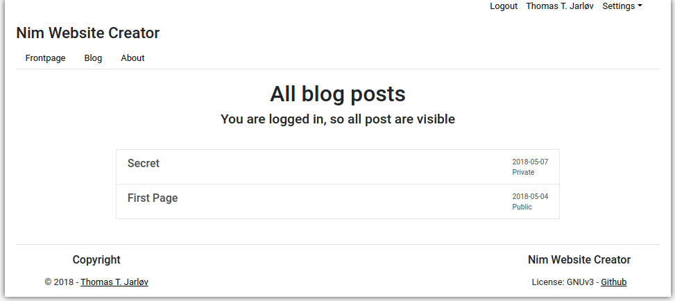
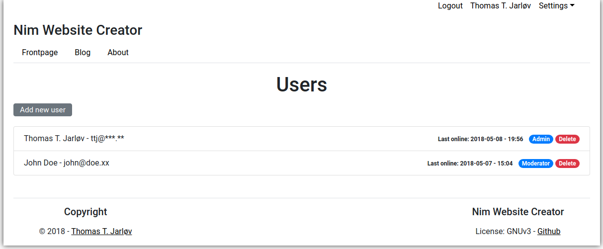

# Nim Website Creator

A quick website tool. Run the nim file and access your webpage.

## Main features:
- Webserver hosting your page on 127.0.0.1:7000
- Blog - add and edit blog posts
- Pages - add and edit pages
- Custom head, navbar and footer
- Define your own JS and CSS imports
- Upload files (private or public)
- Multiple users
- Edit js/js.js and css/style.css
- Add plugins

## Compile

**Config:**

Rename `config_default.cfg` to `config.cfg` and insert your data.

**Compile:**

`nim c -d:release -d:ssl websitecreator.nim`

**First run:**

On the first run it is advised to use the following parameters:

`nim c -d:release -d:ssl -d:newdb -d:newuser -d:insertdata websitecreator.nim`

**Options:**
* `-d:nginx` = Used to close the streaming connection when using nginx as a webserver
* `-d:newdb` = Generate the database
* `-d:newuser` = Add an admin user
* `-d:insertdata` = Insert base data
* `-d:dev` = Development
* `-d:devemailon` = Send email when `dev` is activate

## Content

Blog posts can be set as private or public.

**Blog**


**Blog page**


**Blog post edit 1**


**Blog post edit 2**


## Screenshot

**Frontpage**


**Settings**


**Settings head, header & footer**


**Files**


**Users**


**Profile**


## Plugins

Plugins will be loaded at compiletime with macros. Plugins are placed in the `plugins`-folder. An example plugin (mailer) is available in the `plugins`-folder.

Plugins will be available at `www.example.com/e/<plugin-route-name>`

### Enable plugin

To enable a plugin, add the plugin name and full path to `plugin/plugin_import.txt`. See the file for example.

Use the format:
```
pluginname:/home/full/path/to/plugin/folder/pluginname
```

### Plugin structure

A plugin needs the following structure:

```
mailer/
  - html.tmpl   (optional)
  - mailer.nim  (required)
  - routes.nim  (required)
  - update.sql  (optional)
  - public/
    - js.js     (optional)
    - style.css (optional)
```

### mailer.nim
Includes proc's etc.

It is required to include a proc named `proc <pluginname>Start*(db: DbConn) =`. If this proc is not needed, just discard the content.

### routes.nim
Includes the URL routes.

### js.js and style.css

On compiletime the js and css file in the plugins public folder will be copied to the official public folder, and a `<link>` and `<script>` tag will be appended to the HTML code.

### Plugin: Mailer

Add elements containing mail subject, description and date for sending the mail. When the element is saved, every 12th hour a cronjob will run to check, if it is time to send the mail.

All registrered users will receive the email.

You can access the plugin at `/e/mailer`. The link can be added to the navbar manually.